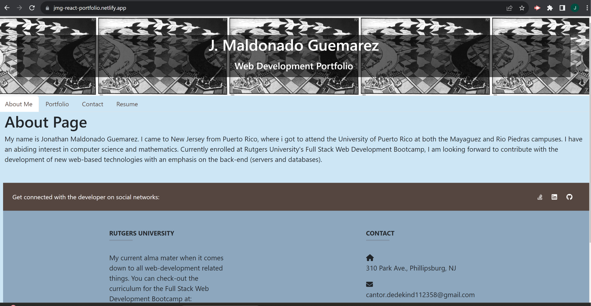
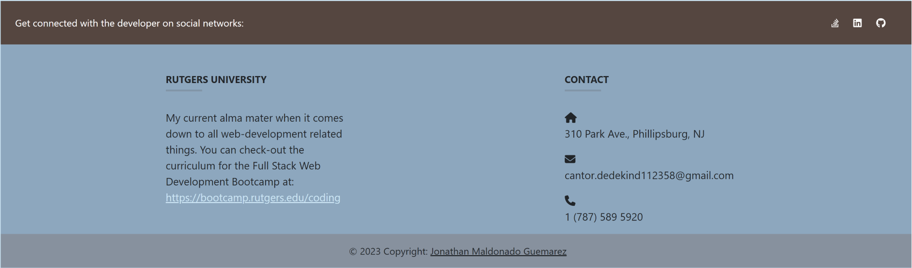
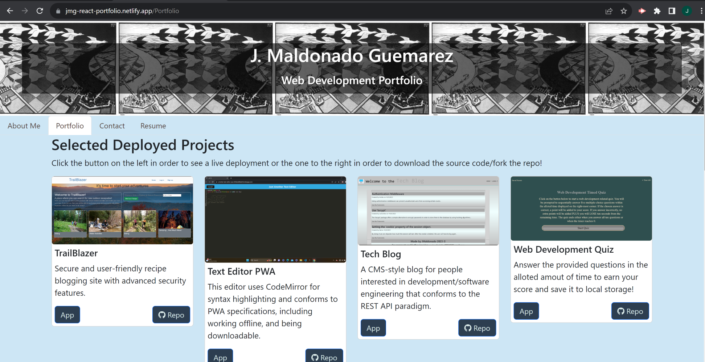
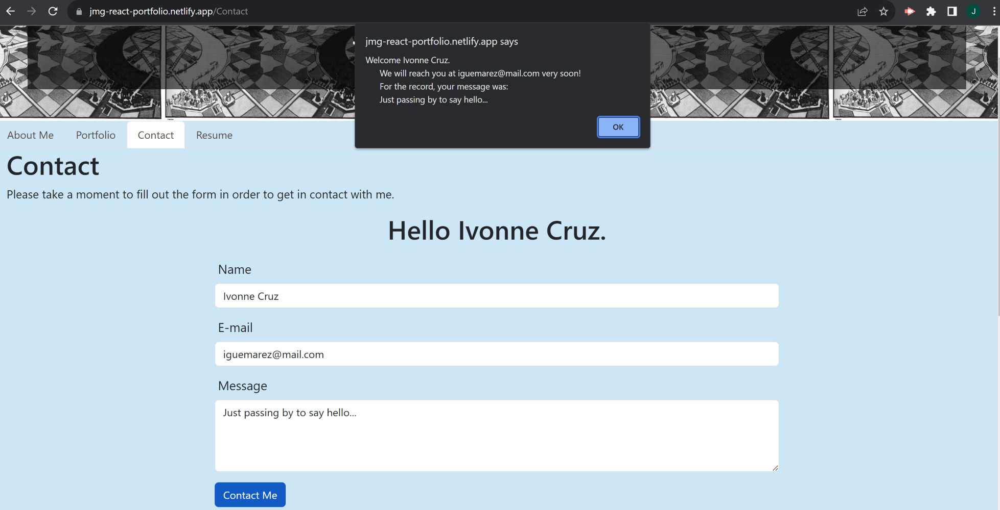
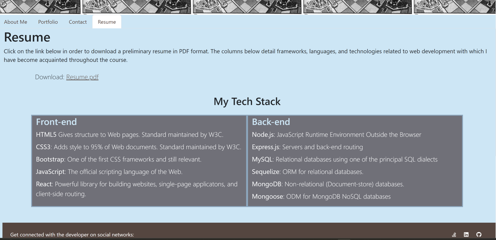
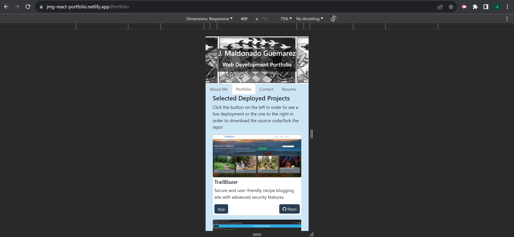

# React Portfolio

## Description

For various years, React has been one of the most used JavaScripts libraries, easing the front-end development of single-page web applications (as well native applications) in a way that allows them to be easily scalable and maintanable. Partly due to the rich ecosystem of packages, libraries, and plug-ins that has been built around it and also due to its convenient way of mixing JS interactivity/functionality with HTML rendering through JSX, being React-literate is one of the most sought after skills in the web development job market. Given that having a solid grasp of React seems to be a pre-requisite to make oneself marketable and that a professional looking portfolio that adroitly employs current technological innovations helps a would-be-contender for a position to stand-out, we decided to create a new portfolio using React and the Vite. It will be deployed to Netlify, so that anyone interested can demo it, see the live deployments of selected projects, leave messages and contact information, and in general get know a little more about our own interests and abilities. This project also allowed us to practice using the React-router in order to perform client-side rendering (depending on state variables) and routing as opposed to be making computationally more expensive calls to a back-end server. This is also supposed to provide a smoother user-experience, minimizing the page-reloads and instead making extensive use of HMR (Hot Module Replacement). Thinking of an app solely in terms of dinamically rendered components that get mounted  to a virtual DOM was surely a challenge, even for relatively simple tasks like adding stylings through CSS frameworks(Bootstrap) and icons/images. But is was a worthwhile challenge once you realize what is to be gained in terms of organization and optimization.

## Table of Contents

- [Installation](#installation)
- [Usage](#usage)
- [Credits](#credits)
- [License](#license)

## Installation

The application is available for online use at Netlify (see [Usage](#usage) below). However, for developers interested in understanding the code/tinkering wit it, the following local installation is a possibility:

1. Go to the CLI of Git BASH and use the "mkdir" command to create a new directory for the folder. Use the "cd" command to change directory.

2. Navigate to <https://github.com/jguemarez/ReactPortfolio>, press the "<> Code" button, choose the most convenient way to clone the repo, and copy it to the clipboard.

3. Go back to Git BASH and append the copied string to the command "git clone" .

4. Enter whathever means of authorization (e.g. a passphrase for SSH Keys) they ask you.

5. Within Git BASH, run "npm install" to install the dependencies in the package.json files. That script will install dependencies both for development and production environments.

6. Either run the command "npm run dev", to start the Vite development server , or "npm run build", meant for production mode (this option bundles the JS and JSX files and optimizes the code, creating a "dist' from which to serve the app).

8.Once connection to a port (the default is 3000) has been achieved, the app will automatically open in the browser and will be ready to demo and modify/debug.

## Usage

Disclaimer: Screenshots present the website as rendered on the Google Chrome Version 116.0.5845.188 (Official Build) (64-bit), run in a Windows 11 Home Version 22H2 environment.

1.By navigating to the Netlify-hosted URL <https://jmg-react-portfolio.netlify.app/>, the user will be presented with the following view:

2.You can click the icons to visit my profiles in Stack Overflow, LinkedIn, and GitHub. Also there is a link to this Bootcamp's page and my contact information:

3.Clicking on the 'Portfolio' tab we get to see a selection of six deployed applications with buttons allowing you to navigate to the live URL as well as the GitHub repo:

4.Clicking on the 'Contact' tab, we see a form where the visitor can enter his/her name, e-mail, and a message. Using state variables, a personalized greeting is displayed on top of the input fields and an alert message is displayed on the submit event. The email's format is also validated by testing a regular expression against the input string:

5.The 'Resume' tab links to a page where the visitor can download a mock resume and also see lists of my full-stack proficiencies:

6.The site uses the Bootstrap grid system (via importing the relevant components from the 'react-bootstrap' package), which ensures it is responsive:

## Credits

This React-based portfolio was developed from scratch by Jonathan Maldonado Guemarez.

The GitHub repo can be found at: <https://github.com/jguemarez/ReactPortfolio>.

The Netlify-deployed app can be found at: <https://jmg-react-portfolio.netlify.app/>

The .gitignore file was lifted from the GitLab class repo found at: <https://git.bootcampcontent.com>.

This app's scripts work both in the browser and in the Node.js JavaScript runtime environment. The latest stable (recommended version) can be found at: <https://nodejs.org/en/download>

We use npm for the specification (semantic versioning) of the app's dependencies and their installation. Here is the URL for the official site of the npm registry: <https://www.npmjs.com>
Here are the dependencies for the development and production environments that we added, including links to find their most recent versions:

Dev-dependencies:
1.TypeScript-related packages: They provide types definitions for React and React-DOM
        "@types/react": "^18.0.28" <https://www.npmjs.com/package/@types/react>
        "@types/react-dom": "^18.0.11" <https://www.npmjs.com/package/@types/react-dom>

2.Vite: "4.5.0" Provides a front-end development environment for our React app using Hot Module Replacement and building the app for production using file-bundling. Includes a development server out-of-the-box.
<https://www.npmjs.com/package/vite>

3.Vite.js/Plugin-React:"^4.0.0" Enables fast refresh in development, automatic JSX runtime, Babel plugins/presets, etc.
<https://www.npmjs.com/package/@vitejs/plugin-react>

Dependencies:
1.React: "^18.2.0". Contains the functionality to define React components.
<https://www.npmjs.com/package/react>

2.React-DOM: "^18.2.0". Allows rendering the components when they get addded as nodes to the VDOM.
<https://www.npmjs.com/package/react-dom>

3.React Router DOM: "^6.19.0". Contains bindings for using React Router in web applications.
<https://www.npmjs.com/package/react-router-dom>

4.React-Bootstrap: "^2.9.1". In combination with Bootstrap, we can add responsiveness and style to customizable JSX components that we can import to our project.
<https://www.npmjs.com/package/if-env>

5.Bootstrap: "^5.3.2". Package that allows us to use the Bootstrap CSS framework by importing it directly to our JSX files.
<https://www.npmjs.com/package/bootstrap>

6.Font-Awesome related dependencies: They were used to import the different icons used in the site as well as the necessary component to render them within the React app.
        "@fortawesome/fontawesome-svg-core": "^6.4.2",
        "@fortawesome/free-brands-svg-icons": "^6.4.2",
        "@fortawesome/free-solid-svg-icons": "^6.4.2",
        "@fortawesome/react-fontawesome": "^0.2.0",

## How to Contribute

If you want to contribute, feel free to fork the repo, modify the repo on your local machine and then open a pull request. That way I can review the changes before deciding whether to merge them in the codebase or not.

## Tests

The app was extensively tested for bugs using Chrome Dev Tools, so that it was able to be deployed without problems to Netlify on the first try.
However, developers should keep an eye for any error thrown either in the browser or in the Bash terminal (when serving using localhost) and, if possible, open an issue in the GitHub repo detailing the bug.

## Questions

Feel free to checkout my GitHub profile at: <https://www.github.com/jguemarez>.
For further questions and comments, you can mail me to the following address: <cantor.dedekind112358@gmail.com>.

## License

This is an open-source project under the terms of agreement provided by the MIT license.
For more information, click on the following link: <https://opensource.org/license/mit>
